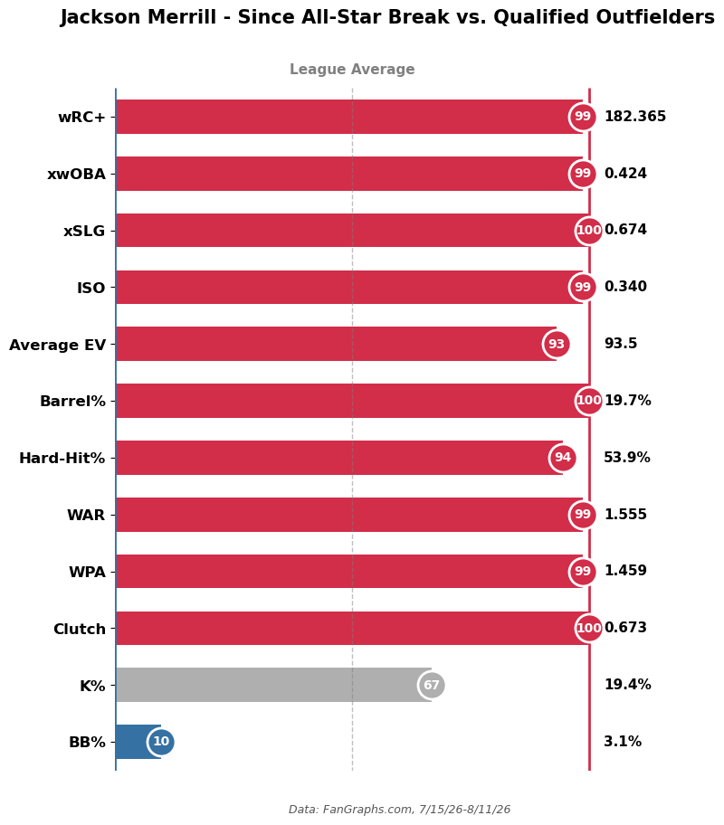
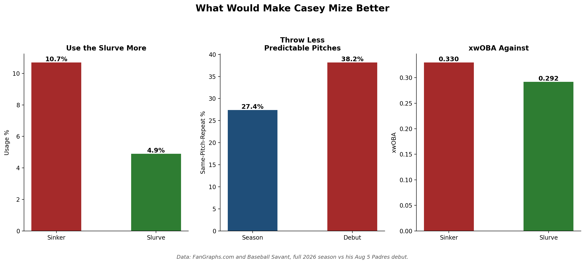
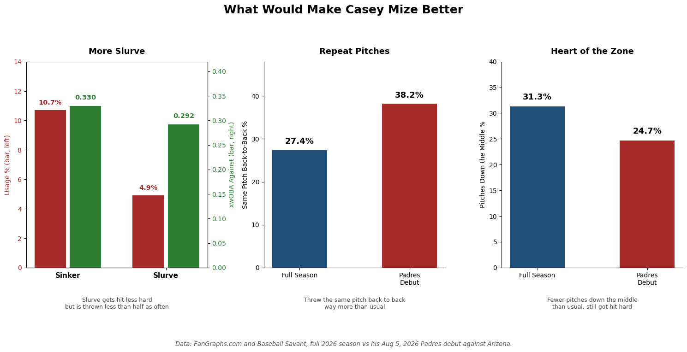
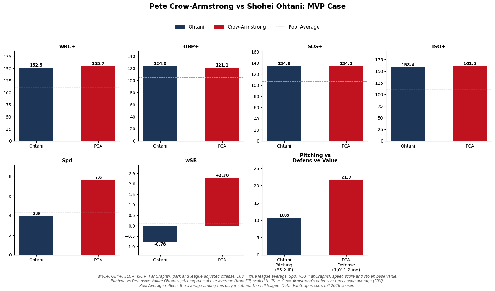
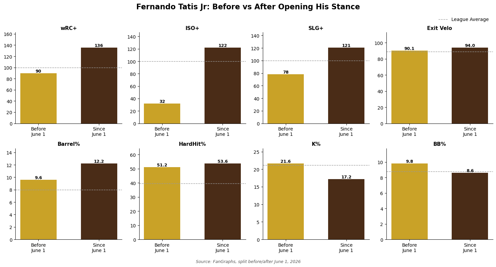
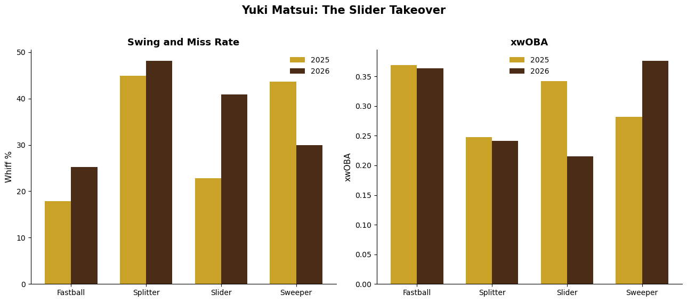

# Baseball Case Study

Using Python, FanGraphs, and Statcast data to break down players and figure out what's actually behind their numbers.

## Project Goal
The purpose of this project is to answer one question: how can data be used to make pitchers and hitters better?

## Why
After 4 years of D3 baseball I'm trying to learn the analytics side to work in baseball.

## What I look at

**Pitching**
* Statcast data (Savant)
* Pitch usage
* Whiff rate and chase rate
* Pitch shape, spin axis, movement
* Velocity, spin rate
* Release point, extension, arm slot
* xBA, xwOBA, run value per pitch
* ERA vs FIP
* Sequencing
* Stuff+, Pitching+, Location+

**Hitting**
* Exit velocity, barrel rate, hard-hit rate
* xwOBA, xSLG, xBA vs actual results
* Plate discipline: Z-Swing%, O-Swing%, Swing%, Whiff%, Z-Contact%, chase rate
* Batted ball profile: pull%, launch angle, GB/FB/LD splits
* wRC+, wOBA, and other park-adjusted production stats
* Win Probability Added and clutch
* Percentile rankings, pulled or modeled from TJStats

**General**
* Defensive run value (OAA, DRS, FRV)
* WAR and value breakdowns (offense, defense, base running)
* Before/after splits tied to mechanical, approach changes or hot/cold streaks

## Tools
Python, PyBaseball, Pandas, Matplotlib, Jupyter Notebook, FanGraphs, Baseball Savant, TJStats, VS Code

## Projects

### Jackson Merrill (Since All-Star Break, 2026)
Since the break, Merrill's been the best hitter on the Padres and arguably in the whole league. 99th percentile wRC+, 100th percentile xSLG and Barrel% against qualified outfielders. Providing what the Padres desperately need in a playoff push.

### Casey Mize: Padres Debut Breakdown (2026)
Debut looked bad on paper, 9.15 FIP across 3.1 innings, but the stuff was never the issue. Splitter graded 97 tjStuff+ that night, slider 105, both right in line with his season marks. The tell was pitch sequencing, he repeated the same pitch back to back 38.2% of the time, well above his 27.4% season rate, and Arizona sat on it and punished him. His slurve grades 100 tjStuff+ on the season, same tier as his fastball and slider, yet sits at just 5% usage, his most underleveraged pitch by far (.224 xwOBA, .283 xwOBACON). Sinker's the weak link at 94 tjStuff+, still getting 19% usage against RHH. Splitter's actually been his best swing-and-miss pitch all year, 39.2% chase rate and 32.8% whiff rate, both tops in his arsenal. Fix is simple: lean into the slider and slurve more, especially against righties.

 

### Pete Crow-Armstrong vs Shohei Ohtani MVP Case (2026)
If the season ended today, PCA should be NL MVP. He's out hitting Ohtani (155.7 wRC+ to 152.5), out running him (30 SB, +2.3 wSB vs -0.78), and his defense alone (+24 FRV, +22 OAA, +14 DRS over 1,011 innings) is worth about 2x what Ohtani's pitching has added. It's also worth more to a Cubs team that needs it than to a stacked Dodgers roster that makes the playoffs either way. PCA MVP. MVPETE

### Fernando Tatis Jr. (2026)
Opened up his stance and has returned to elite play since June.

### Adrian Morejon (2026)
Best left handed reliever in baseball this year by the numbers. Elite in Stuff+, Pitching+, K-BB%, FIP-, xFIP-, and SIERA against every qualified lefty reliever with 30+ IP. Pay the man!!

### Yuki Matsui (2026)
ERA dropped this year and it traces back to one pitch. He reshaped his slider, spin axis shifted, throwing it way more, same arm slot and release point, just a complete different pitch with completely different results.

### Bradley Rodríguez
First one I did. Usage vs whiff rate, checking if he was underusing pitches that were actually working.

[Whiff Rate vs Usage](bradley_rodriguez_pitch_analysis.png)
)
