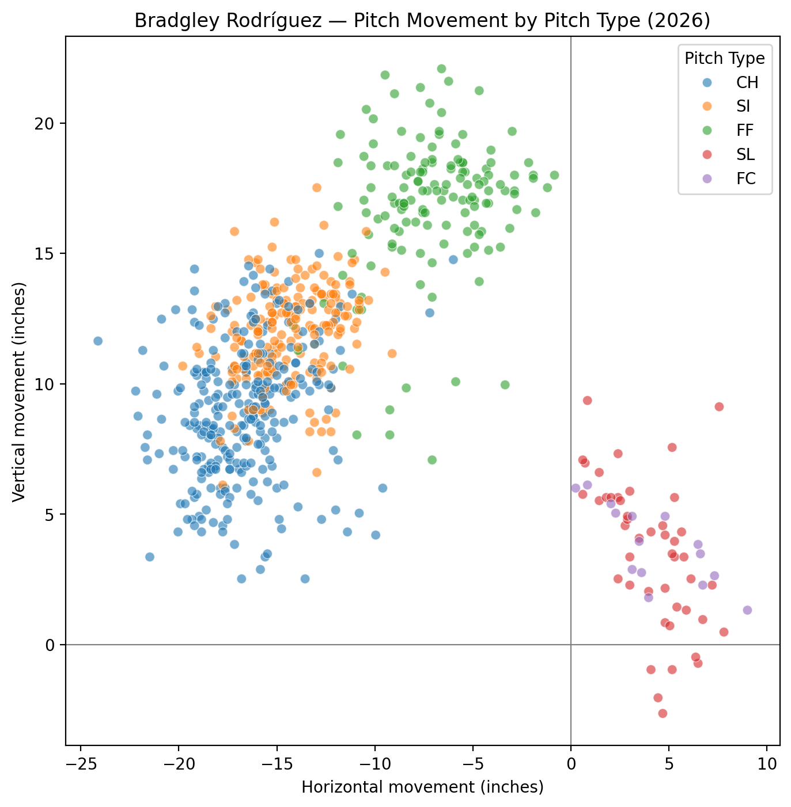
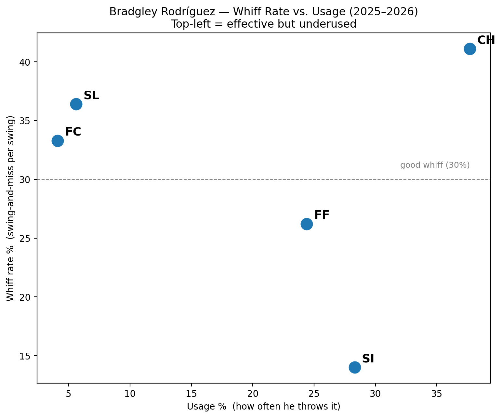

# Bradgley Rodríguez: Pitch Usage vs Whiff Rate

**Date:** June 27, 2026

First one I did. Usage vs whiff rate, checking if he was underusing pitches that were actually working.

## Method

**Data sources**
- Baseball Savant pitch-level Statcast data, pulled with `pybaseball`

**Date ranges**
- 2025: full season
- 2026: 3/1/26 to 6/27/26

**How it was calculated**
- Movement = Statcast `pfx_x` and `pfx_z` converted from feet to inches, 2026 only.
- Whiff rate = whiffs / swings, 2025 and 2026 combined. Whiffs include swinging strikes and foul tips. Swings add fouls and balls in play.
- Usage = share of all pitches, 2025 and 2026 combined. Dashed line = 30% whiff rate reference.

## Files

| File | Contents |
|---|---|
| `bradgley_rodriguez_pitch_usage_2026.ipynb` | Statcast pulls, whiff and usage table, both charts saved to `../figures/` |
| `bradgley_rodriguez_statcast_2026.csv` | Statcast pitch data, 2026 through 6/27 (written by the notebook) |
| `bradgley_rodriguez_statcast_2025.csv` | Statcast pitch data, 2025 (written by the notebook) |
