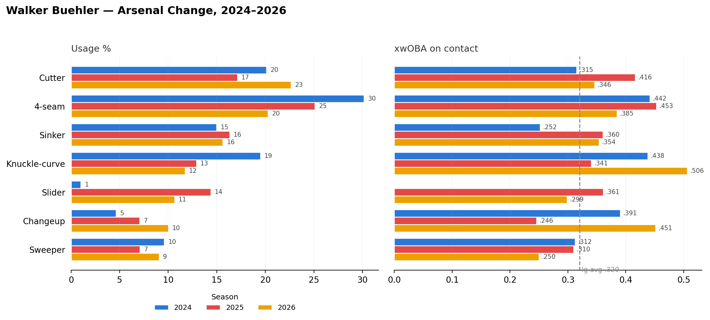

# Walker Buehler: Arsenal Change, 2024–2026

**Date:** August 14, 2026

*2026 numbers through 6/27.*

Buehler keeps rebuilding his pitch mix. From 2024 to 2026:
- Four seam: 30% to 25% to 20%
- Cutter: 20% to 17% to 23%
- Slider: 1% to 14% to 11%
- Changeup: 5% to 7% to 10%

The contact hasn't followed. xwOBA on contact this year:
- Knuckle curve: .506
- Changeup: .451
- Four seam: .385

Only the sweeper (.250) and slider (.299) sit under the .320 league line.

New mix. Same problem.

## Method

**Data sources**
- Baseball Savant pitch-level Statcast data, pulled with `pybaseball`

**Date ranges**
- 2024 and 2025: full seasons
- 2026: 3/1/26 to 6/27/26

**How it was calculated**
- Usage % = share of all pitches by pitch type, each season.
- xwOBA on contact = mean `estimated_woba_using_speedangle` on balls in play, each pitch type and season. Cells with fewer than 10 balls in play are left blank.
- Dashed line = .320 league-average xwOBA on contact reference.
- Statcast has revised some 2026 values since this chart was first made (2026 slider .313 → .299, sweeper .237 → .250, a few others by .001). The notebook uses current data.

## Files

| File | Contents |
|---|---|
| `buehler_arsenal_change_2026.ipynb` | Statcast pulls, mix and contact quality by season and month, earlier chart versions, featured chart saved to `../figures/` |
| `buehler_statcast_2024_2026.csv` | Statcast pitch data, 2024 to 6/27/26 (written by the notebook) |
