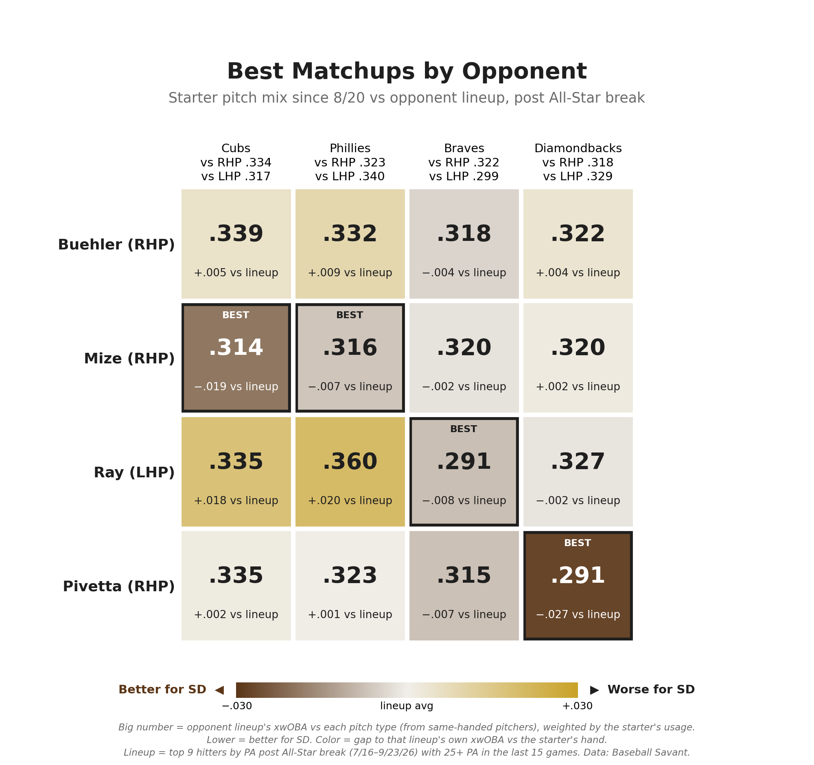
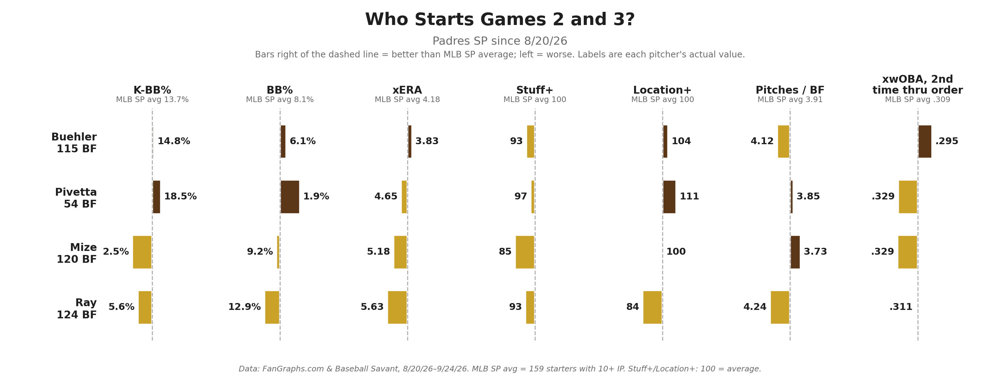

# Who Starts Games 2 and 3? Padres Playoff Rotation

**Date:** September 24, 2026

If the Padres get in, King has Game 1. The question is what comes after.

I weighted each opponent's xwOBA vs every pitch type by how often our starters have thrown them since 8/20. Same handed pitchers only, vs each team's everyday lineup since the break.

Pivetta has the biggest edge on the board: .291 vs Arizona, .027 under their norm vs righties. It's the curveball. Arizona hits .214 off righty curves, and it's 26% of his mix.

Ray also hits .291 vs Atlanta, mostly because he's a lefty. The Braves hit .299 off lefties and .322 off righties. Same arm hurts him in Philly, where his .360 is the worst mark on the chart.

Mize grades best vs the Cubs (.314) and Phillies (.316) thanks to his splitter. But both lineups crush his four seamer at .357 and .353, and it's 37% of his mix. Mixed with some very poor starts lately he is WAY TOO risky in October.

Buehler doesn't top a single column, but the matchups don't tell the whole story. Since 8/20 he has a 3.83 xERA and 14.8% K-BB, among the best on the staff. He also has two rings and closed out the 2024 World Series. He will definitely get a start in game 3.

How I see it:
Game 1: King
Game 2: Pivetta + Bullpen early
Game 3: Buehler and Ray in tandem + Bullpen early

Either way, expect the bullpen early in games 2 and 3.

## Method

**Data sources**
- Baseball Savant pitch-level Statcast data, pulled with `pybaseball`
- FanGraphs leaderboard exports (manual CSV downloads)

**Date ranges**
- Padres starters (Buehler, Mize, Ray, Pivetta): 8/20/26 to 9/24/26
- Opponent lineups (Cubs, Phillies, Braves, Diamondbacks): post All-Star break, 7/16/26 to 9/23/26, regular season only

**Opponent lineups**
- Each team's top 9 hitters by PA since the break, limited to hitters with 25+ PA in the team's last 15 games so traded, injured or benched players drop out.

**Matchup score**
1. Each starter's pitch usage since 8/20 is grouped into eight pitch types: four-seam, sinker, cutter, slider, sweeper, curveball, changeup, splitter. Knuckle curves and slurves count as curveballs.
2. For each opponent lineup, xwOBA is calculated on plate appearances ending with each pitch type, using only pitchers of the same hand as the starter (LHP for Ray, RHP for the others).
3. The matchup score is the lineup's xwOBA on each pitch type, weighted by the starter's usage of that pitch. Lower = better for the Padres.
4. Chart color shows the score minus the lineup's overall xwOBA vs that hand, so a lineup that is simply weak vs lefties or righties doesn't look like a pitch-mix edge.

xwOBA uses Statcast expected wOBA on batted balls and actual wOBA value on strikeouts, walks and hit-by-pitches.

**Starter comparison chart**
- MLB SP average = 159 starters with 10+ IP since 8/20. xERA league mark is IP-weighted from FanGraphs; K-BB%, BB%, pitches per batter faced and 2nd-time-through xwOBA come from Statcast for the same 159 starters. Stuff+ and Location+: 100 = league average.

## Files

**Code**

| File | Contents |
|---|---|
| `padres_game2_game3_starters_2026.ipynb` | Full pipeline: Statcast pulls, opponent lineups, splits, matchup table, league averages, both charts |
| `matchup.py` | Script version of the pulls, lineups, splits, matchup table and league averages (writes the CSVs below) |
| `charts.py` | Script version of both charts (reads the CSVs below, saves to `../figures/`) |

**Data**

| File | Contents |
|---|---|
| `padres_sp_advanced_2026.csv` | FanGraphs Advanced, Padres SP since 8/20 (K%, BB%, K-BB%, xFIP, SIERA) |
| `padres_sp_statcast_2026.csv` | FanGraphs Statcast, Padres SP since 8/20 (Hard-Hit%, Barrel%, xERA) |
| `padres_sp_stuff_plus_2026.csv` | FanGraphs Stuff+, Padres SP since 8/20 (Stuff+ by pitch, Stuff+, Location+, Pitching+) |
| `padres_sp_location_plus_2026.csv` | FanGraphs Location+, Padres SP since 8/20 (Location+ by pitch) |
| `mlb_sp_10ip_2026.csv` | FanGraphs MLB starters with 10+ IP since 8/20 (league xERA reference) |
| `opponent_lineups_post_asb_2026.csv` | Cubs, Phillies, Braves, Diamondbacks lineups: top 9 by PA post-break with 25+ PA in last 15 games |
| `matchup_table_post_asb_2026.csv` | Matchup score for each starter vs each lineup, plus the lineup's xwOBA vs that hand |
| `mlb_sp_league_averages_2026.csv` | MLB SP average lines used in the starter chart |
| `buehler_statcast_aug20_sep24_2026.csv` | Statcast pitch data, Walker Buehler, 8/20 to 9/24 |
| `mize_statcast_aug20_sep24_2026.csv` | Statcast pitch data, Casey Mize, 8/20 to 9/24 |
| `ray_statcast_aug20_sep24_2026.csv` | Statcast pitch data, Robbie Ray, 8/20 to 9/24 |
| `pivetta_statcast_aug20_sep24_2026.csv` | Statcast pitch data, Nick Pivetta, 8/20 to 9/24 |
