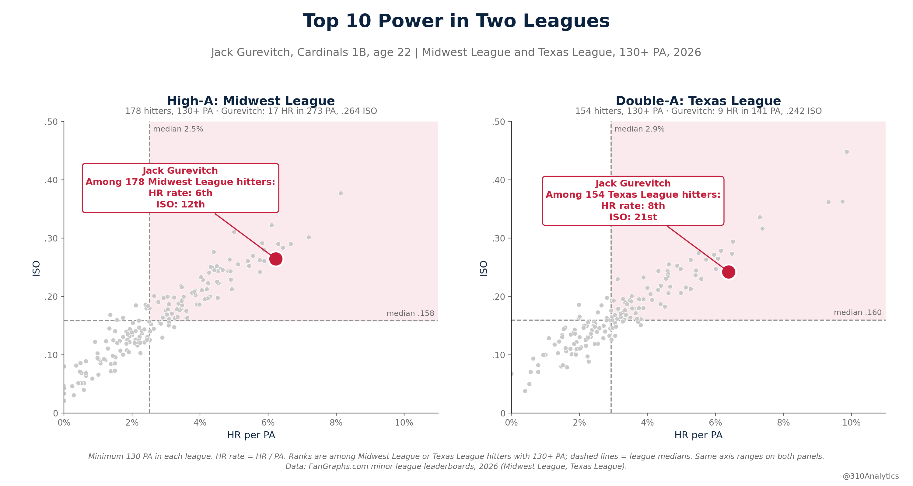
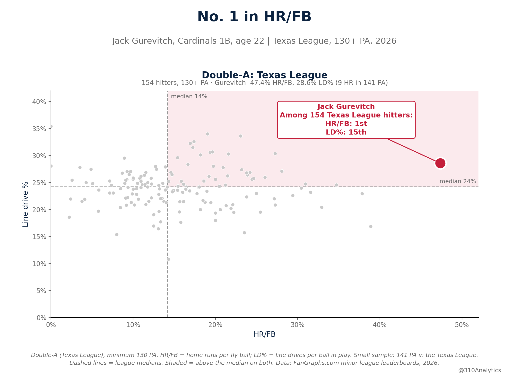
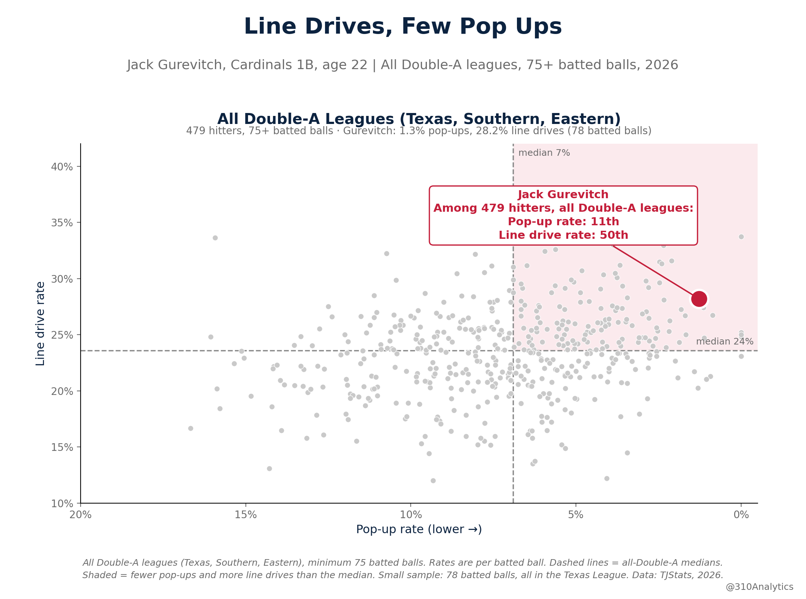
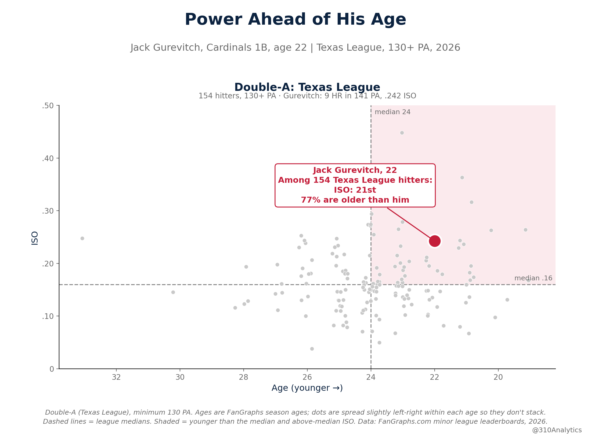
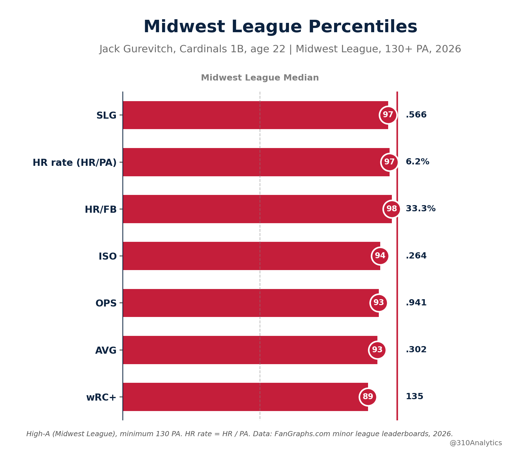
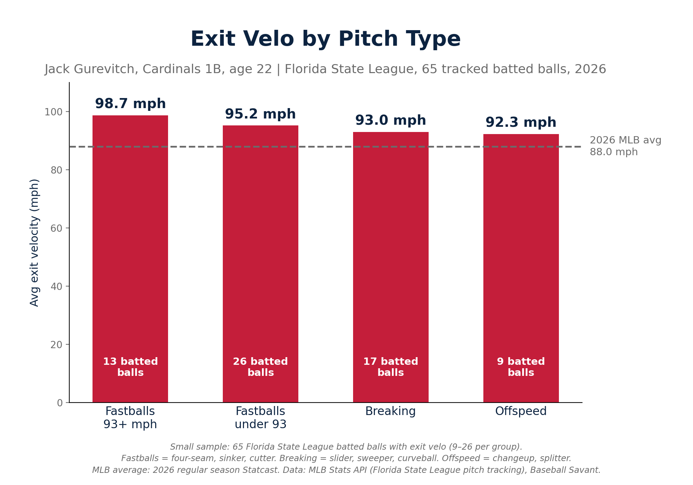

# Jack Gurevitch: Breakout Power Season

**Date:** September 24, 2026

Jack Gurevitch had a big year and not enough people are talking about it.

The Cardinals took him in the third round out of USD in 2025. He hit .371 with 17 homers his last year in San Diego.

In his first full taste of pro ball at 22 years old, he figured it out. He played at three levels and finished with 32 homers, 96 RBI and a .283/.360/.542 line in 119 games.

He did most of his damage at High-A Peoria, where he hit .302 with 17 homers in 59 games. Out of 178 Midwest League hitters he was 6th in HR rate and 12th in ISO.

Springfield didn't slow him down. He hit 9 homers in 141 PA after the call up, 8th in HR rate out of 154 Texas League hitters, and he was younger than 77% of the league.

When he gets it in the air it's usually gone. His 47.4% HR/FB led the Texas League. It's a small sample, but he was 4th in the Midwest League too at 33.3%, so it's not a fluke.

He's not just selling out for fly balls either. Across all of Double-A he popped up on only 1.3% of his batted balls, 11th lowest of 479 hitters, and he hit line drives 28.2% of the time.

And he hits it hard. At Low-A, the only level with Statcast, he averaged 94.9 mph off the bat with a 115 max. MLB average is 88.0. Against 93+ he averaged 98.7.

Gurv has figured it out quickly at each level he continues to climb. He continues to be a gamer, and only time will tell how much damage he can do as he keeps moving up.

#STLCards

## More charts

## Method

**Data sources**
- FanGraphs minor league leaderboards (manual CSV exports): every Midwest League (High-A) and Texas League (Double-A) hitter with 130+ PA in 2026. Standard, Advanced and Batted Ball files, merged on PlayerId.
- TJStats: Gurevitch's 2026 season tables by level, plus a batted-ball leaderboard of every hitter in all three Double-A leagues (Texas, Southern, Eastern; 30 teams, one row per player).
- MLB Stats API: every pitch Gurevitch saw in 2026 from each game's live feed. That's 124 games: 119 regular season plus 5 Texas League playoff games. Pitch tracking only exists for his Low-A games with Palm Beach (Florida State League).
- MLB average exit velo (88.0 mph): 2026 regular season Statcast from Baseball Savant, via `pybaseball`.

**Comparison groups and minimums**

| Rank | Stat | Group | Minimum |
|---|---|---|---|
| 6th of 178 | HR rate (HR / PA), 6.2% | Midwest League hitters | 130 PA |
| 12th of 178 | ISO, .264 | Midwest League hitters | 130 PA |
| T-4th of 178 (tied with one hitter) | HR/FB, 33.3% | Midwest League hitters | 130 PA |
| 89th–98th percentile | SLG, HR rate, HR/FB, ISO, OPS, AVG, wRC+ | Midwest League hitters | 130 PA |
| 8th of 154 | HR rate, 6.4% | Texas League hitters | 130 PA |
| 21st of 154 | ISO, .242 | Texas League hitters | 130 PA |
| 1st of 154 | HR/FB, 47.4% | Texas League hitters | 130 PA |
| 15th of 154 | LD%, 28.6% (FanGraphs) | Texas League hitters | 130 PA |
| Younger than 77% | FanGraphs season age (76.6% are older) | Texas League hitters | 130 PA |
| 11th fewest of 479 | Pop-up rate, 1.3% | All Double-A leagues | 75 batted balls |
| 50th of 479 | Line drive rate, 28.2% (TJStats) | All Double-A leagues | 75 batted balls |

- Rank = hitters strictly better + 1, so tied hitters share a rank. Percentiles are percent ranks against the same 178 hitters, ties averaged.
- Season line (.283/.360/.542, 32 HR, 96 RBI, 119 games) is his regular season across all three levels, from TJStats. It doesn't include the 5 playoff games.
- Line drive rate differs by source: 28.6% in FanGraphs (Texas League, per ball in play) and 28.2% in TJStats (all Double-A leagues, per batted ball).
- Exit velo: 94.9 mph average and 115.0 max on 65 tracked Florida State League batted balls (TJStats and the Stats API agree). The 98.7 mph vs 93+ comes from 13 batted balls, all on fastballs. Fastballs = four-seam, sinker, cutter. Breaking = slider, sweeper, curveball. Offspeed = changeup, splitter.
- Small samples: 141 PA and 78 batted balls in the Texas League, just over each minimum. Exit velo groups are 9 to 26 batted balls each.
- `top10_ranks_2026.csv` ranks every stat in every file in five groups: both leagues at 130+ PA, both leagues limited to hitters 22 or younger, and all Double-A leagues at 75+ batted balls. It then re-ranks him at higher minimums (up to his own PA) to show whether a rank depends on the cutoff.

## Files

**Code**

| File | Contents |
|---|---|
| `jack_gurevitch_2026.ipynb` | Full pipeline: pitch data, pitch tables, rank tables, all six charts (saves to `../figures/`) |
| `statsapi_pull.py` | MLB Stats API pull: game logs and live feeds into `gurevitch_pitches_2026_statsapi.csv` (the notebook only runs it if that file is missing) |
| `gurevitch_tables.py` | Six pitch-level tables from the Stats API pitches |
| `ranks.py` | Rank check (every number on the charts and in the post, recomputed) and the top-10 scan |
| `charts.py` | All six charts |

**Data**

| File | Contents |
|---|---|
| `high_a_standard_2026.csv`, `high_a_advanced_2026.csv`, `high_a_batted_ball_2026.csv` | FanGraphs, all Midwest League hitters with 130+ PA (178) |
| `aa_standard_2026.csv`, `aa_advanced_2026.csv`, `aa_batted_ball_2026.csv` | FanGraphs, all Texas League hitters with 130+ PA (154) |
| `tjstats_batter_batted_ball_2026.csv` | TJStats batted-ball rates, every hitter in all Double-A leagues (820; 479 with 75+ batted balls) |
| `gurevitch_tjstats_*_2026.csv` | TJStats season tables for Gurevitch by level: standard, advanced, batted ball, plate discipline, Statcast |
| `gurevitch_pitches_2026_statsapi.csv` | Every pitch he saw in 2026 (2,136), from the MLB Stats API |
| `pitch_table1_by_pitch_group_2026.csv` | Florida State League: swing, whiff, exit velo and results by pitch group |
| `pitch_table2_fastball_velo_2026.csv` | Florida State League: fastballs 93+ vs under 93 |
| `pitch_table3_hard_hit_by_zone_2026.csv` | Florida State League: hard-hit balls (95+ mph) by zone |
| `pitch_table4_vs_hand_2026.csv` | Vs RHP and LHP at each level, regular season |
| `pitch_table5_by_count_2026.csv` | Results by count before the PA's final pitch, regular season |
| `pitch_table6_playoffs_2026.csv` | Texas League playoffs (5 games) |
| `rank_check_2026.csv` | Every chart and post number: shown value, recomputed value, source file, group, match |
| `top10_ranks_2026.csv` | Every stat where he ranks top 10 in each group, with the minimum check |
