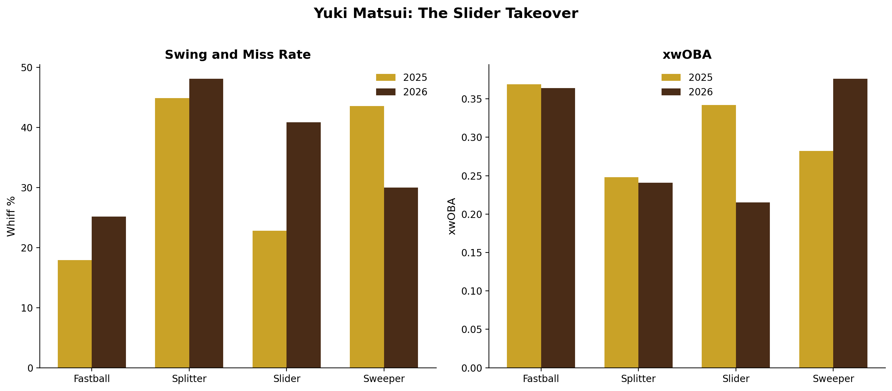

# Yuki Matsui: The Slider Takeover

**Date:** August 9, 2026

ERA dropped this year and it traces back to one pitch. He reshaped his slider, spin axis shifted, throwing it way more, same arm slot and release point, just a complete different pitch with completely different results.

## Method

**Data sources**
- Baseball Savant pitch arsenal stats (whiff% and xwOBA by pitch), saved from the leaderboard on 8/9/26 into `matsui_savant_arsenal_2026.csv`
- Baseball Savant pitch-level Statcast data, pulled with `pybaseball` (usage, velo, spin, spin axis, arm angle, release point)
- Baseball Reference season lines, pulled with `pybaseball` (ERA)

**Date ranges**
- 2025: full season
- 2026: 3/1/26 to 8/9/26

**How it was calculated**
- Whiff% and xwOBA by pitch come straight from Savant's arsenal stats for each season.
- Slider shape (spin axis, movement, spin) and arm angle/release point are season averages from the Statcast pull.
- Whiff% in the notebook's Statcast checks = swinging strikes / swings. Chase% = swings at pitches outside the zone / pitches outside the zone.

## Files

| File | Contents |
|---|---|
| `matsui_slider_2026.ipynb` | Statcast pull, pitch-level checks, earlier chart versions, featured chart saved to `../figures/` |
| `matsui_savant_arsenal_2026.csv` | Savant pitch arsenal stats, 2025 and 2026 (2026 as of 8/9/26) |
| `matsui_statcast_2025_2026.csv` | Statcast pitch data, 2025 and 2026 through 8/9 (written by the notebook) |
