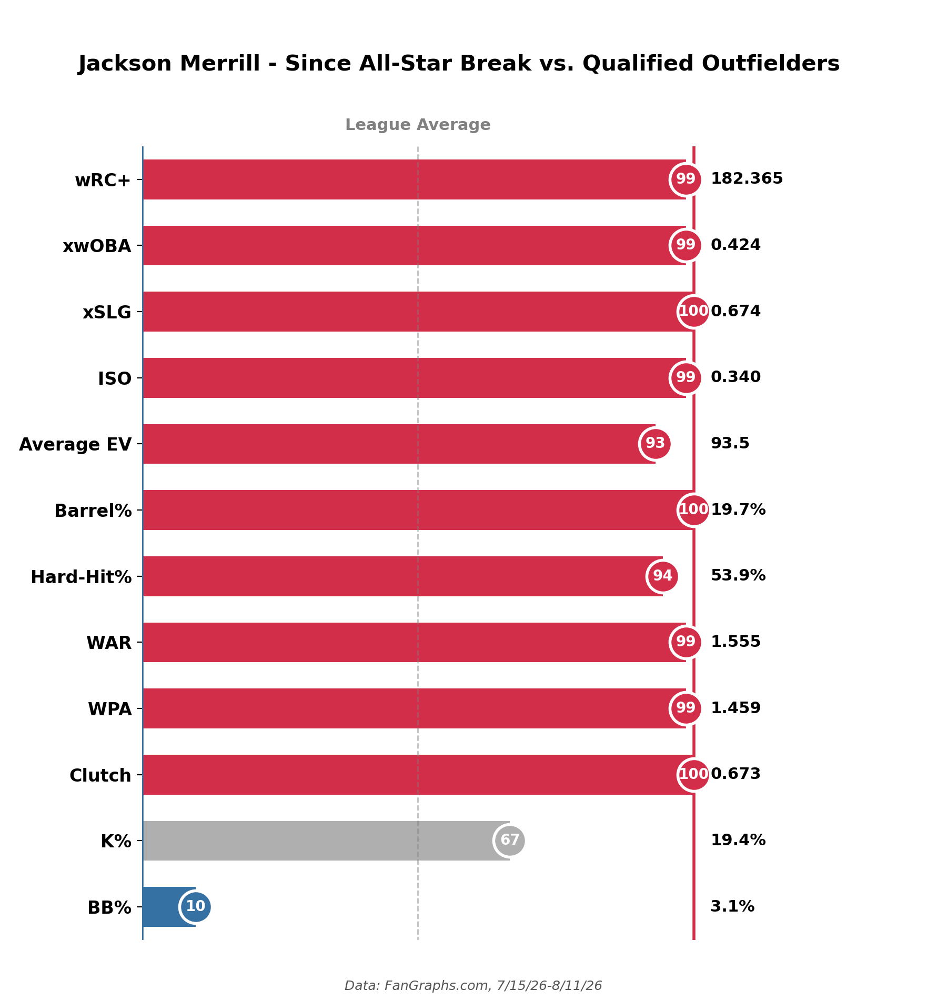
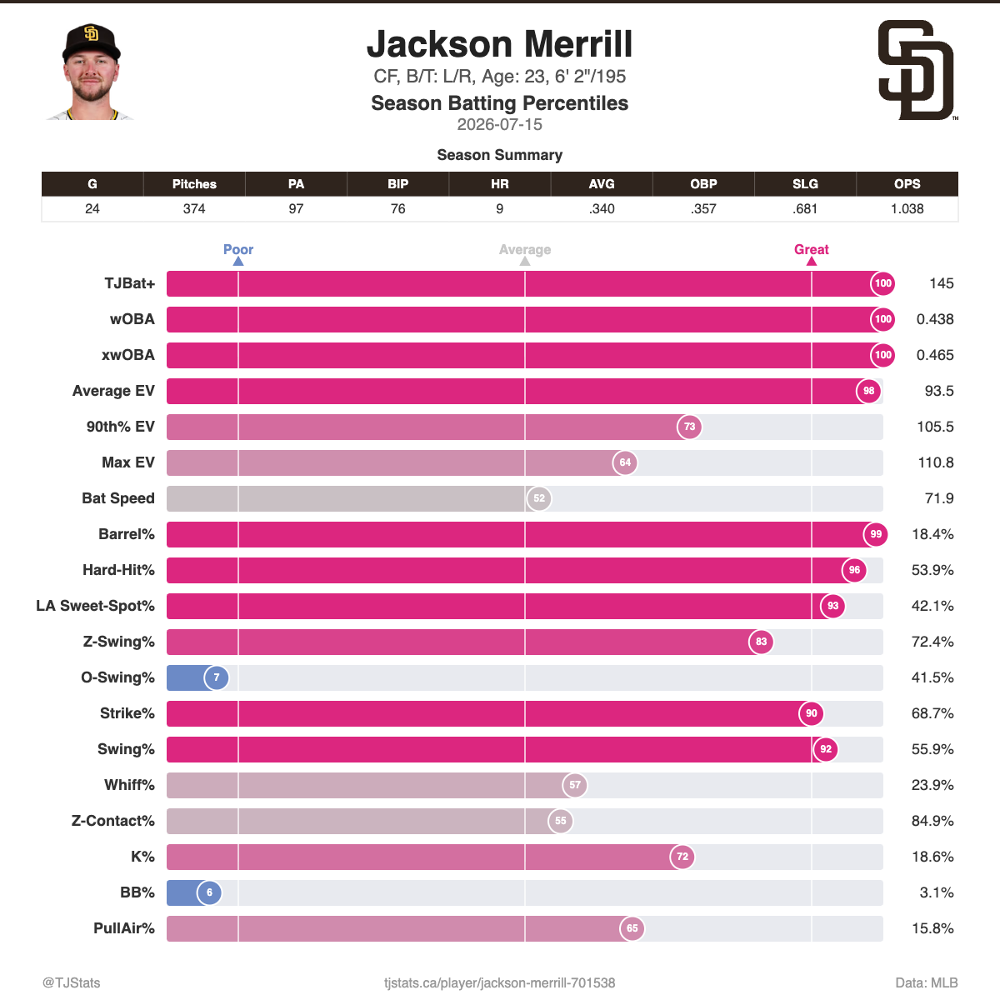

# Jackson Merrill: Since the All-Star Break

**Date:** August 11, 2026

Since the break, Merrill's been the best hitter on the Padres and arguably in the whole league. 99th percentile wRC+, 100th percentile xSLG and Barrel% against qualified outfielders. Providing what the Padres desperately need in a playoff push.

## Method

**Data sources**
- FanGraphs leaderboard exports, qualified outfielders (manual CSV downloads)
- TJStats season percentile card, exported from tjstats.ca (image only, not rebuilt here)

**Date ranges**
- FanGraphs: 7/15/26 to 8/11/26, 72 qualified outfielders
- TJStats card: 2026 season through 7/15/26

**How it was calculated**
- Exports are merged on FanGraphs PlayerId.
- Each stat is ranked as a percentile among the 72 qualified outfielders. K% is ranked so lower = higher percentile.
- Bar color: red = 67th percentile or higher, gray = 33rd to 66th, blue = below 33rd. Dashed line = 50th percentile (league average).

## Files

| File | Contents |
|---|---|
| `merrill_post_asb_2026.ipynb` | Loads the exports, builds percentiles, saves the chart to `../figures/` |
| `qualified_of_advanced_2026.csv` | FanGraphs Advanced (wRC+, ISO, K%, BB%) |
| `qualified_of_statcast_2026.csv` | FanGraphs Statcast (EV, Barrel%, Hard-Hit%, xwOBA, xSLG) |
| `qualified_of_value_2026.csv` | FanGraphs Value (WAR) |
| `qualified_of_win_probability_2026.csv` | FanGraphs Win Probability (WPA, Clutch) |
| `qualified_of_standard_2026.csv` | FanGraphs Standard (not used in the chart) |
| `qualified_of_batted_ball_2026.csv` | FanGraphs Batted Ball (not used in the chart) |
| `qualified_of_plus_stats_2026.csv` | FanGraphs + Stats (not used in the chart) |
