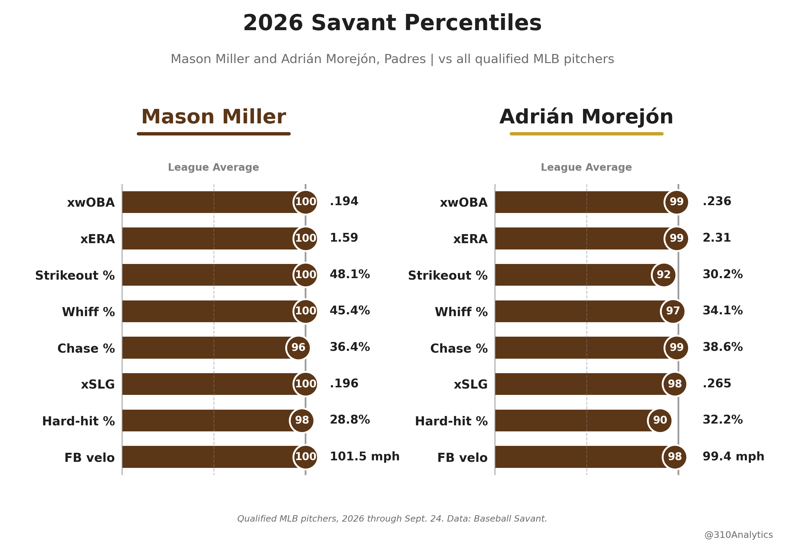
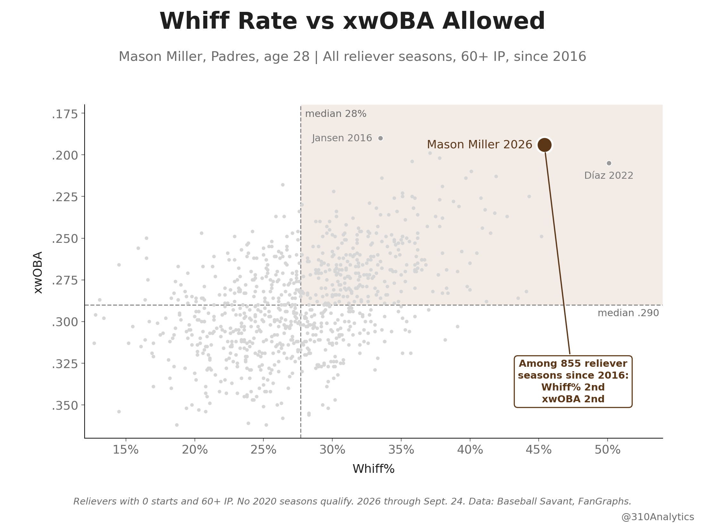
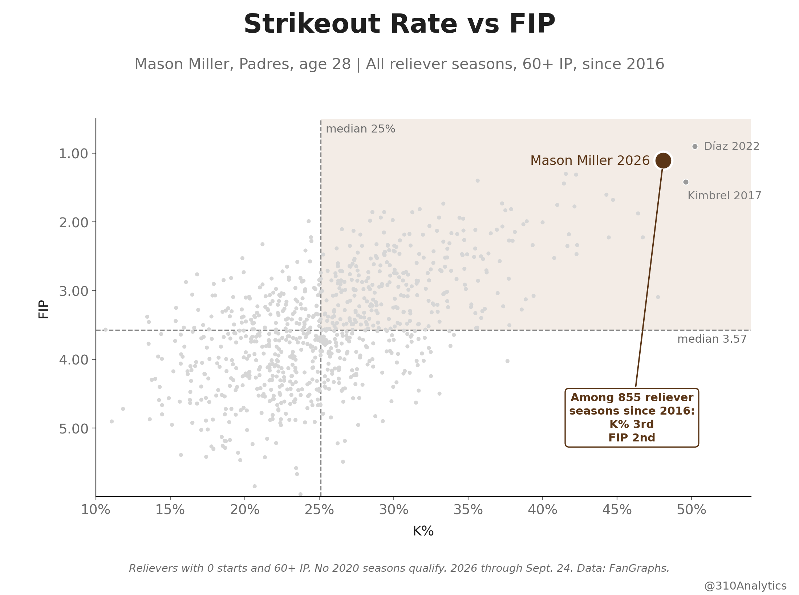
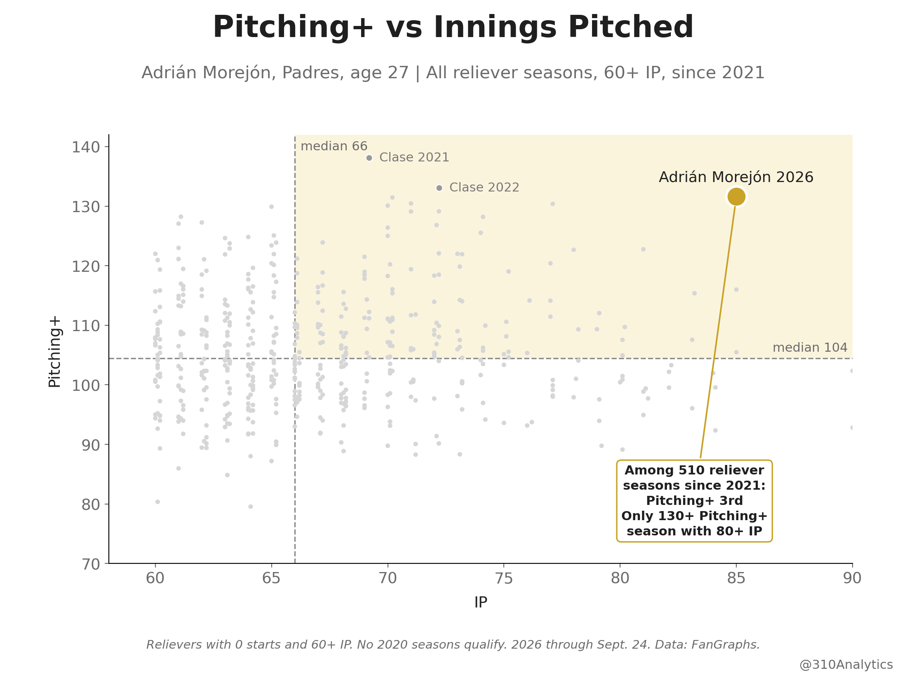

# Mason Miller and Adrián Morejón: Two Historic Relief Seasons

**Date:** September 25, 2026

The Padres have two of the best relief seasons of the last decade sitting in their bullpen right now.

I compared Mason Miller and Adrián Morejón to every reliever season since 2016 with 60+ IP. That's 855 seasons from 478 different relievers.

Miller has struck out 48.1% of the hitters he's faced. Only Edwin Díaz in 2022 and Craig Kimbrel in 2017 have done better. Hitters miss on 45.4% of their swings, second only to Díaz. When they do make contact, it's weak. His .194 xwOBA is second only to Kenley Jansen in 2016, and his 1.11 FIP is second only to Díaz.

He's not new to this either. His 45.2% whiff rate last year ranks 3rd on the same list.

The slider does most of the damage. He throws it half the time, hitters whiff on 56% of their swings, and they have a .136 xwOBA against it.

The Fangraphs pitch model actually like him less than they used to. His Stuff+ went from 129 to 127 to 119, and it's mostly the fastball. His arm slot has climbed about 7 degrees since 2024, and the pitch lost almost 4 inches of run without picking up any ride. So the model sees a normal 99+ fastball that's just a tick harder. Its grade has gone from 126 to 120 to 106.

However, it doesn't matter much. He's still averaging 101.5 and he can run it up to 104 on a good night. Hitters whiff on 37% of their swings against it, and it's saved 13 runs this year.

Morejón's stuff has gone the other way. His Stuff+ has gone up every year, from 124 to 126 to 129, and his 132 Pitching+ is 3rd of 510 reliever seasons since 2021. Only Emmanuel Clase in 2021 and 2022 graded higher.

And he's doing it while eating innings. He's thrown 85, tied for 12th most of those 855 seasons, with 28 holds.

He's the ONLY reliever since 2021 with a 130+ Pitching+ over 80+ innings.

His 99 to 101 mph sinker has saved 12 runs on its own, and hitters whiff on 55% of their swings against his changeup. He's 99th percentile on Savant in xwOBA, xERA, chase rate and barrel rate. Hitters chase, and when they connect they fail to barrel him up.

I'll take that back end 1-2 punch against anyone in October.

Tatis is right. Pay Morejón!

#Padres  
#Forthefaithful

## Method

**Data sources**
- FanGraphs reliever leaderboards (manual CSV exports): Standard, Advanced, Statcast, Win Probability, Stuff+, and Batted Ball, merged on Season and PlayerId
- Baseball Savant: percentile ranks, arsenal stats, expected stats, and pitch-level Statcast via `pybaseball` (cache on), plus Savant's custom leaderboard for season whiff%

**Comparison group**
- 855 reliever seasons since 2016 with 0 starts and 60+ IP, from 478 relievers. No 2020 season qualifies (60-game schedule).
- 510 of those seasons (2021 on) for Stuff+ and Pitching+, which start in 2021.
- 2026 through Sept. 24.

**Notes**
- Ranks count seasons strictly better, plus one. Savant percentiles are among all 2026 pitchers who meet Savant's qualifying minimum.
- Whiff% counts foul tips as whiffs and bunt attempts as swings (Savant's definition).
- Savant xwOBA and whiff% are matched to the 855 FanGraphs seasons on MLBAM ID and season; every season matched.
- Fastball comparison: Miller's four-seamers in 2024, 2025 and 2026 vs every 2026 four-seamer and every 2026 four-seamer at 99+ mph. Horizontal break is arm-side inches, and vertical approach angle is computed at the front of the plate from the Statcast release data.

## Files

**Code**

| File | Contents |
|---|---|
| `miller_morejon_2026.ipynb` | Full pipeline: FanGraphs ranks, Savant tables, reliever history, fastball profile, all four charts (saves to `../figures/`) |
| `ranks.py` | Merges the six FanGraphs tabs and ranks both pitchers among the 855 seasons |
| `savant.py` | Savant pulls (only when a CSV is missing), pitch results, and the xwOBA / whiff% history for all 855 seasons |
| `fastball.py` | Miller's four-seamer 2024-2026 vs league four-seamers |
| `charts.py` | All four charts |

**Data**

| File | Contents |
|---|---|
| `mlb_rp_{standard,advanced,statcast,win_probability,stuff_plus,batted_ball}_2016_2026.csv` | FanGraphs, every reliever season since 2016 with 0 GS and 60+ IP (855) |
| `savant_percentiles_2026.csv` | Savant percentile ranks for both pitchers, 2026 |
| `savant_raw_2026.csv` | Raw 2026 values for the percentile chart (xwOBA, xERA, K%, whiff%, chase%, xSLG, hard-hit%, FB velo) |
| `savant_arsenal_2026.csv` | Arsenal by pitch: usage, velo, spin, movement, whiff%, put away%, xwOBA, run value |
| `savant_pitch_results_2026.csv` | By pitch from pitch-level data: whiff%, chase%, CSW%, hard-hit%, barrel%, avg EV |
| `mason_miller_statcast_{2024,2025,2026}.csv`, `morejon_statcast_2026.csv` | Pitch-level Statcast, regular season |
| `savant_expected_stats_2016_2026.csv`, `savant_custom_whiff_2016_2026.csv` | Savant season leaderboards used for the history |
| `mlb_rp_savant_history_2016_2026.csv` | xwOBA and whiff% for all 855 reliever seasons |
| `savant_history_ranks_2016_2026.csv` | Every Miller and Morejón season ranked on xwOBA and whiff% |
| `fg_ranks_2026.csv`, `fg_top5_2016_2026.csv` | 2026 FanGraphs ranks for both pitchers, and top 5 seasons for K%, xERA, FIP, Pitching+, Stuff+ |
| `miller_fastball_profile_2024_2026.csv`, `miller_fastball_percentiles_2026.csv` | Four-seamer profile by year vs league, and 2026 percentiles |
