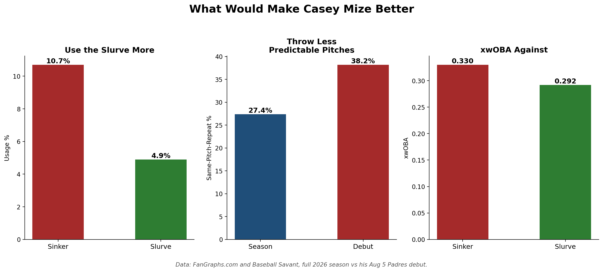
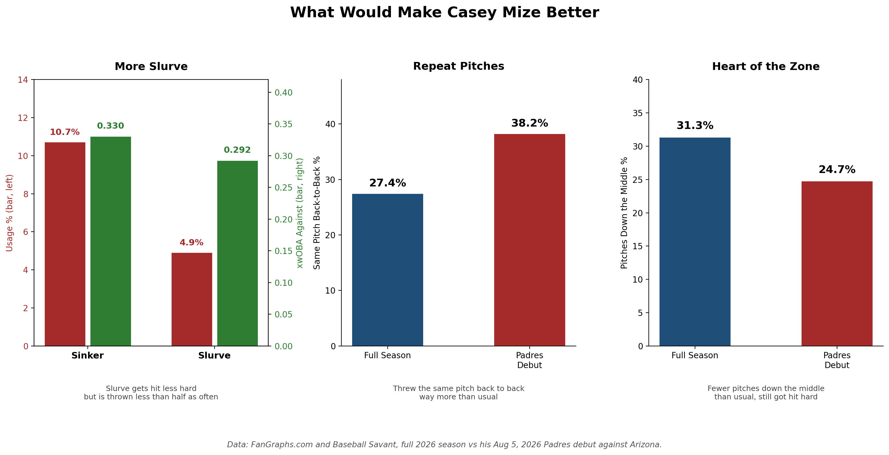

# Casey Mize: Padres Debut Breakdown

**Date:** August 10, 2026

Debut looked bad on paper, 9.15 FIP across 3.1 innings, but the stuff was never the issue. Splitter graded 97 tjStuff+ that night, slider 105, both right in line with his season marks. The tell was pitch sequencing, he repeated the same pitch back to back 38.2% of the time, well above his 27.4% season rate, and Arizona sat on it and punished him. His slurve grades 100 tjStuff+ on the season, same tier as his fastball and slider, yet sits at just 5% usage, his most underleveraged pitch by far (.224 xwOBA, .283 xwOBACON). Sinker's the weak link at 94 tjStuff+, still getting 19% usage against RHH. Splitter's actually been his best swing-and-miss pitch all year, 39.2% chase rate and 32.8% whiff rate, both tops in his arsenal. Fix is simple: lean into the slider and slurve more, especially against righties.

## Method

**Data sources**
- Baseball Savant pitch-level Statcast data, pulled with `pybaseball`
- FanGraphs and TJStats numbers typed in by hand (tjStuff+, FIP and chase rate in the write-up come from TJStats and FanGraphs, not calculated in the notebook)

**Date ranges**
- Padres debut: 8/5/26 vs Arizona
- 2026 season: 3/1/26 to 8/9/26
- Slider history: 2024 and 2025 seasons

**How it was calculated**
- Same-pitch-repeat % = share of pitches (after the first in each plate appearance) that match the previous pitch type.
- Usage and xwOBA against by pitch type come from the 2026 Statcast pull.
- The values plotted in both featured charts are stored in `mize_hand_entered_values_2026.csv`, typed from notebook output and FanGraphs.

## Files

| File | Contents |
|---|---|
| `mize_padres_debut_2026.ipynb` | Statcast pulls, debut vs season breakdowns, both featured charts saved to `../figures/` |
| `mize_hand_entered_values_2026.csv` | Values behind the two featured charts, with source notes |
| `mize_statcast_debut_2026.csv` | Statcast pitch data, 8/5/26 debut (written by the notebook) |
| `mize_statcast_2026.csv` | Statcast pitch data, 2026 through 8/9 (written by the notebook) |
| `mize_statcast_2025.csv` | Statcast pitch data, 2025 (written by the notebook) |
| `mize_statcast_2024.csv` | Statcast pitch data, 2024 (written by the notebook) |
