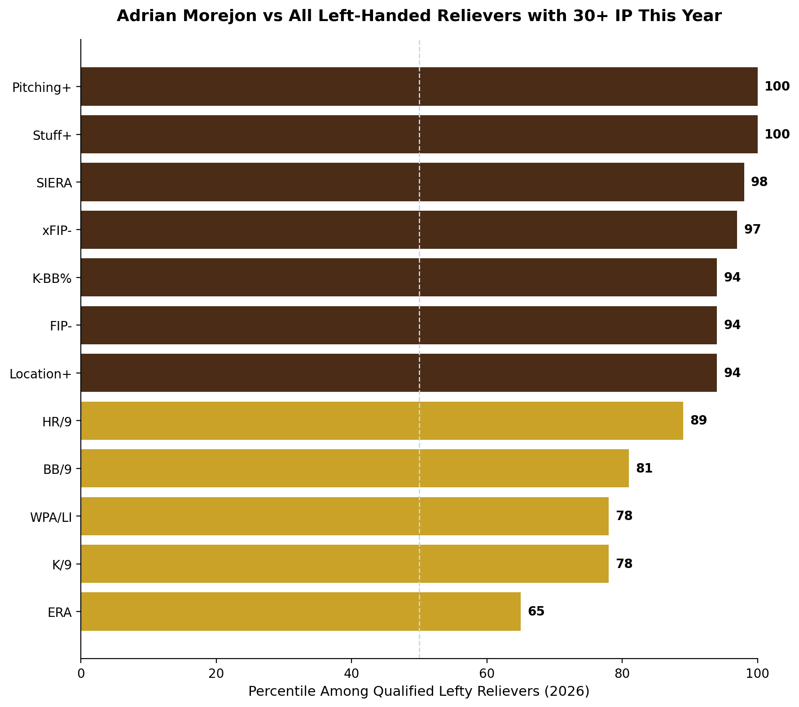
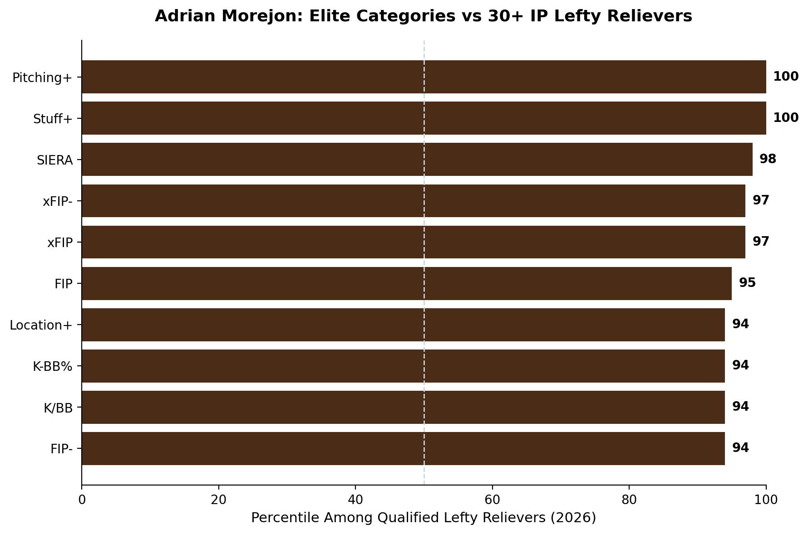

# Adrian Morejon: Best Lefty Reliever in Baseball

**Date:** August 9, 2026

Best left handed reliever in baseball this year by the numbers. Elite in Stuff+, Pitching+, K-BB%, FIP-, xFIP-, and SIERA against every qualified lefty reliever with 30+ IP. Pay the man!!

## Method

**Data sources**
- FanGraphs leaderboard exports, left-handed relievers (manual CSV downloads)

**Date ranges**
- 2026 season as of 8/9/26
- Pool: 63 left-handed relievers with 30+ IP

**How it was calculated**
- Exports are merged on MLBAM ID, then filtered to 30+ IP.
- Percentile = share of the pool at or below Morejon's value (`scipy` `percentileofscore`). For stats where lower is better (ERA, FIP, FIP-, xFIP, xFIP-, SIERA, BB/9, HR/9, WHIP, AVG), the percentile is flipped so higher = better.
- Full profile chart: brown = 90th percentile or higher, gold = below 90th. Elite categories chart: only stats at the 90th percentile or higher. Dashed line = 50th percentile.

## Files

| File | Contents |
|---|---|
| `morejon_bullpen_2026.ipynb` | Loads the exports, builds percentiles, saves both charts to `../figures/` |
| `lefty_rp_advanced_2026.csv` | FanGraphs Advanced (K%, BB%, K-BB%, ERA, FIP, xFIP, SIERA, FIP-, xFIP-) |
| `lefty_rp_pitch_models_2026.csv` | FanGraphs pitch models (Stuff+, Location+, Pitching+) |
| `lefty_rp_standard_2026.csv` | FanGraphs Standard (IP, G, SV, HLD) |
| `lefty_rp_win_probability_2026.csv` | FanGraphs Win Probability (WPA, WPA/LI, Clutch) |
