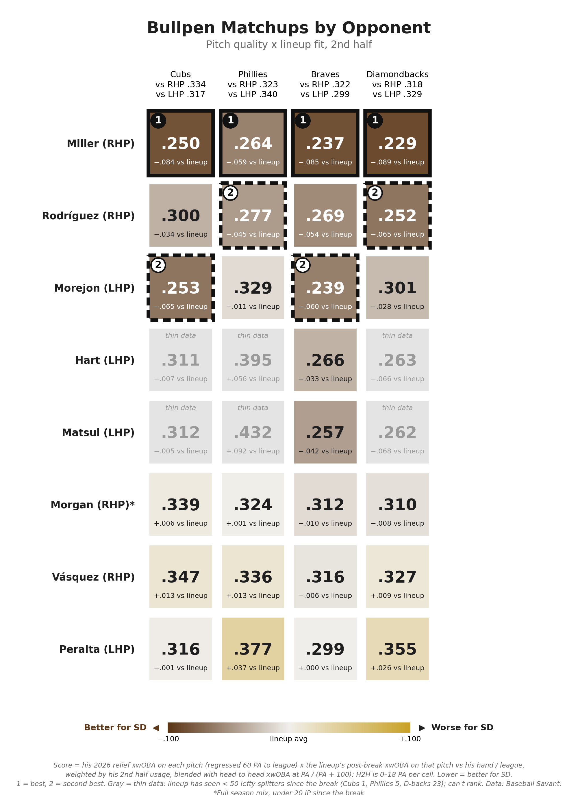
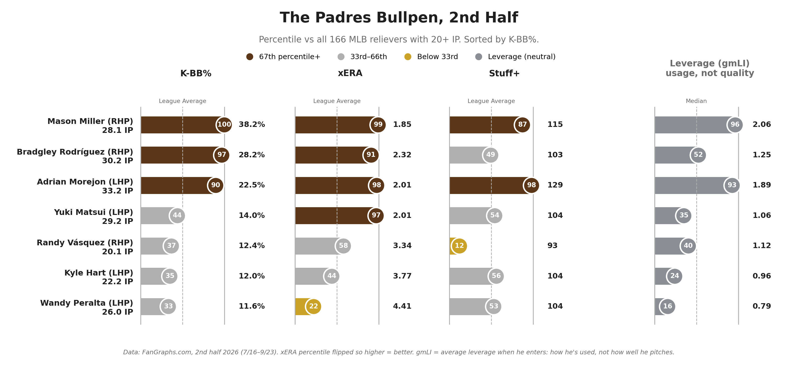

# Who Pitches the 6th? Padres Playoff Bullpen

**Date:** September 24, 2026

The starters post ended with the pen taking over early in Games 2 and 3. So I ran every Padres reliever against each possible playoff lineup, looking at how good his pitches have been this year and how that lineup has hit them since the break.

Miller closes. Not much to debate there. He's the best reliever in baseball and grades as the top matchup vs all four teams. 38.2% K-BB since the break is the best of 166 relievers, and his slider has allowed a .131 xwOBA all year.

Morejón gets the 8th. 129 Stuff+ and he grades almost dead even with Miller vs the Cubs and Braves. On paper Philly is his toughest matchup. They hit .340 off lefties and he throws his sinker about half the time. I still trust him. He's been one of the best setup men in baseball all year and I'm not taking the ball from him.

Rodríguez gets the 7th. 28.2% K-BB with a changeup allowing .189. After Miller he's the best matchup in the pen vs the Phillies and D-backs.

The 6th goes to Matsui or Morgan depending on who's due up. Matsui has a 2.01 xERA since the break and gets the lefties. Morgan gets the righties. He misses bats with a 24.2% K rate this year and grades better than Vásquez vs every team. The walks (13.1%) are the risk.

The rest of the pen:

Hart is the third lefty behind Morejón and Matsui. 3.77 xERA, 104 Stuff+, and a good look vs the Braves.

Adam is the wildcard. He had a 2.51 ERA before the shoulder strain but he's looked shaky on his rehab assignment. If he finds it he moves way up.

Vásquez has a 3.34 xERA but his stuff grades in the 12th percentile. He grades right around every lineup's norm.

Peralta is last. 4.41 xERA and he's a lefty, which is the worst thing you can be against the Phillies right now.

The 6th by opponent:  
Cubs: Matsui vs lefties, Morgan vs righties  
Phillies: Morgan. They hit .340 off lefties.  
Braves: Matsui, with Hart behind him. They only hit .299 off lefties.  
D-backs: Matsui vs lefties, Morgan vs righties

How I see it:  
9th: Miller  
8th: Morejón  
7th: Rodríguez  
6th: Matsui or Morgan  
Low leverage: Vásquez, Peralta

#Padres

## Method

**Data sources**
- Baseball Savant pitch-level Statcast data, pulled with `pybaseball`
- FanGraphs leaderboard exports, all MLB relievers with 20+ IP in the 2nd half (manual CSV downloads)

**Date ranges**
- Relievers: 2nd half (7/16/26 to 9/23/26) for pitch mix, full 2026 for pitch quality. Relief outings only: games he started are dropped.
- Opponent lineups (Cubs, Phillies, Braves, Diamondbacks): post All-Star break, 7/16/26 to 9/23/26. Same lineups as the starters project: top 9 by PA with 25+ PA in the last 15 games.
- Griffin Canning is excluded (DFA'd). David Morgan (under 20 IP since the break) uses his full-season relief mix.

**Bullpen quality chart**
- Percentile vs all 166 relievers with 20+ IP in the 2nd half. xERA is flipped so higher = better. gmLI is shown separately: it measures how he's used, not how well he pitches.

**Matchup chart score**
1. Pitch quality: each reliever's 2026 relief xwOBA on each pitch type, regressed toward league average for that pitch and hand: (PA × his xwOBA + 60 × league xwOBA) / (PA + 60).
2. Lineup fit: the lineup's post-break xwOBA on that pitch type from same-handed pitchers.
3. Combined per pitch: pitcher xwOBA × lineup xwOBA / league xwOBA, weighted by his usage.
4. Head-to-head: his 2026 xwOBA vs the lineup's current hitters, blended in at PA / (PA + 100). Every cell has 0–18 head-to-head PA.
5. Cells where the lineup has seen fewer than 50 of a pitch type from that hand are grayed out as thin data and can't rank 1 or 2. That's the Matsui and Hart splitter cells vs the Cubs, Phillies, and D-backs.

Pitch types are grouped the same way as the starters project: knuckle curves and slurves count as curveballs. xwOBA uses Statcast expected wOBA on batted balls and actual wOBA value on strikeouts, walks, and hit-by-pitches.

## Files

**Code**

| File | Contents |
|---|---|
| `padres_bullpen_matchups_2026.ipynb` | Full pipeline: Statcast pulls, both tables, pitch quality, matchup scores, both charts |
| `bullpen_matchup.py` | Script version of the post-break pulls, Table 1 and Table 2 |
| `bullpen_quality.py` | Script version of the pitch quality model and matchup scores (needs the post-break pulls) |
| `charts.py` | Script version of both charts (saves to `../figures/`) |

**Data**

| File | Contents |
|---|---|
| `mlb_rp_advanced_2h_2026.csv` | FanGraphs Advanced, all relievers 20+ IP, 2nd half (K%, BB%, K-BB%, xFIP, SIERA) |
| `mlb_rp_statcast_2h_2026.csv` | FanGraphs Statcast, same pool (IP, xERA, Hard-Hit%, Barrel%) |
| `mlb_rp_stuff_plus_2h_2026.csv` | FanGraphs Stuff+, same pool (Stuff+, Location+, Pitching+) |
| `mlb_rp_win_probability_2h_2026.csv` | FanGraphs Win Probability, same pool (WPA, gmLI) |
| `*_statcast_post_asb_2026.csv` | Statcast relief pitches since 7/16, one file per reliever (written by the notebook) |
| `*_statcast_2026_relief.csv` | Statcast relief pitches, full 2026, one file per reliever including Morgan (written by the notebook) |
| `table1_mix_fit_2026.csv` | Table 1: pitch-mix fit only, each reliever vs each lineup |
| `table2_heart_of_lineup_2026.csv` | Table 2: each lineup's top 4 hitters and the best, second, and worst reliever mix vs each |
| `pitch_quality_2026.csv` | Each reliever's raw and regressed xwOBA by pitch type |
| `matchup_quality_2026.csv` | Quality-adjusted matchup scores used in Chart 2 |
