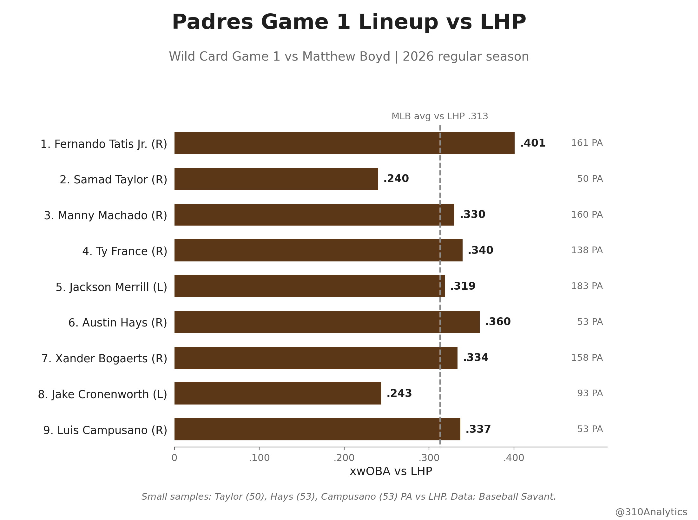

# Padres vs Matthew Boyd: Wild Card Game 1 Lineup

**Date:** September 29, 2026

Seven righties against Boyd. Smart. 14 of the 15 homers he gave up this year came from righties.

How the lineup has hit lefties this year:  
Tatis: .309/.404/.583  
Taylor: .319/.360/.404  
Machado: .229/.300/.400  
France: .288/.370/.483  
Merrill: .280/.302/.440  
Hays: .380/.396/.560  
Bogaerts: .245/.335/.309  
Cronenworth: .250/.315/.310  
Campusano: .283/.377/.435

Tatis is the best of the bunch with a .401 xwOBA against lefties. Taylor at 2 makes sense too. He's hitting .319 off lefties and gives Stammen another righty right behind Tatis.

Machado has more hits off Boyd than anyone in this lineup. He's 9 for 20 with four doubles and a homer.

Sit on the heater. Boyd throws it to righties 47% of the time at 92.8, it only gets whiffs 16.7% of the time, and righties have a .354 xwOBA against it.

Get King through 5 or 6 with a lead and let Morejón and Miller shut the door.

#Padres  
#ForTheFaithful

## Method

**Data source**
- Baseball Savant pitch-level Statcast, pulled with `pybaseball` (cache on)

**Date ranges**
- Lineup vs LHP: 2026 regular season, March 25 to Sept. 27 (the full season per the MLB schedule). All nine hitters' plate appearances vs left-handed pitchers, including any time with other teams.
- Career vs Boyd: every Statcast pitch Matthew Boyd (MLBAM 571510) has thrown since his 2015 debut, regular season and postseason (2022, 2024, 2025). Spring training is left out.
- Boyd's splits and pitch mix: 2026 regular season, 22 games through Sept. 24.

**Notes**
- xwOBA uses Statcast expected wOBA on batted balls and actual wOBA value on strikeouts, walks, and hit-by-pitches. The MLB average vs LHP (.313) is every 2026 plate appearance against a lefty.
- Small samples: Taylor (50 PA), Hays (53) and Campusano (53) vs LHP. Career lines vs Boyd are 0 to 24 PA; Hays, Taylor, Cronenworth and Campusano have fewer than 10.
- Whiff% counts foul tips as whiffs and bunt attempts as swings (Savant's definition). Pitch xwOBA is on plate appearances that ended with that pitch.

## Files

**Code**

| File | Contents |
|---|---|
| `padres_wc_game1_boyd_2026.ipynb` | Full pipeline: Statcast pulls, all four tables, the chart (saves to `../figures/`) |
| `game1.py` | Pulls and tables: lineup vs LHP, career vs Boyd, Boyd's 2026 splits and pitch mix vs RHH |
| `charts.py` | The lineup vs LHP chart |

**Data**

| File | Contents |
|---|---|
| `lineup_vs_lhp_2026.csv` | Each hitter vs LHP in 2026 (PA, AVG, OBP, SLG, xwOBA, K%, BB%), in lineup order, plus the MLB average |
| `career_vs_boyd_2015_2026.csv` | Each hitter's career line vs Boyd, with regular season and postseason PA |
| `boyd_splits_2026.csv` | Boyd's 2026 splits vs RHH and LHH |
| `boyd_mix_vs_rhh_2026.csv` | Boyd's 2026 pitch mix vs RHH: usage, velo, whiff%, xwOBA |
| `boyd_statcast_2026.csv` | Every pitch Boyd threw in the 2026 regular season |
| `boyd_vs_lineup_pitches_2015_2026.csv` | Every pitch Boyd has thrown to these nine hitters (regular season and postseason) |
