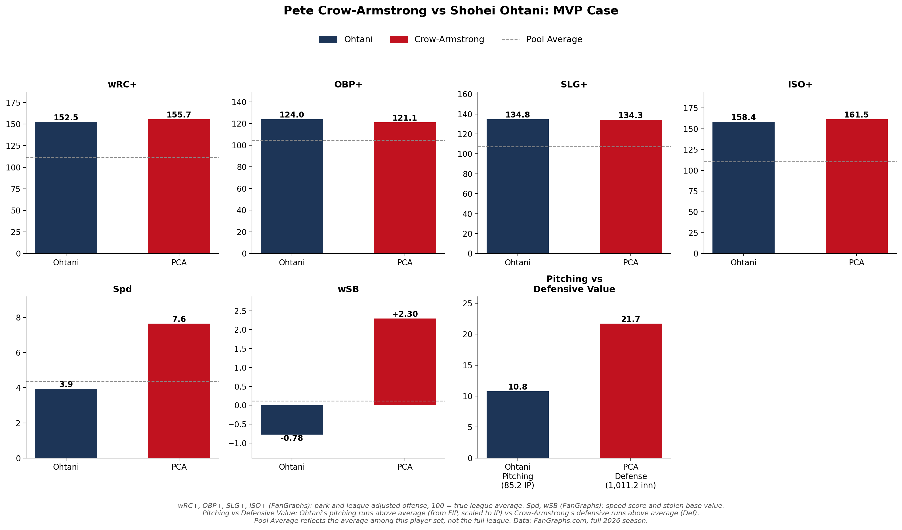
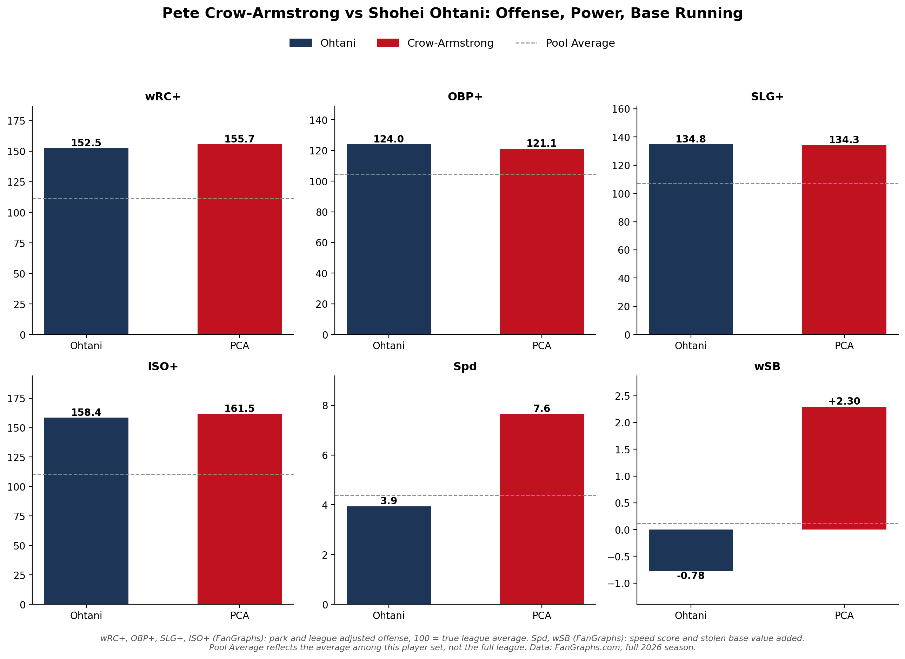

# Pete Crow-Armstrong vs Shohei Ohtani: MVP Case

**Date:** August 9, 2026

If the season ended today, PCA should be NL MVP. He's out hitting Ohtani (155.7 wRC+ to 152.5), out running him (30 SB, +2.3 wSB vs -0.78), and his defense alone (+24 FRV, +22 OAA, +14 DRS over 1,011 innings) is worth about 2x what Ohtani's pitching has added. It's also worth more to a Cubs team that needs it than to a stacked Dodgers roster that makes the playoffs either way. PCA MVP. MVPETE

## Method

**Data sources**
- FanGraphs leaderboard exports (manual CSV downloads)

**Date ranges**
- 2026 season as of 8/9/26
- Hitter pool: 142 hitters with 366+ PA
- Starter pool: 58 starters with 116+ IP
- Fielder pool: 122 fielders with 644+ innings

**How it was calculated**
- wRC+, OBP+, SLG+, ISO+ are FanGraphs plus stats (100 = league average). Spd and wSB are FanGraphs speed score and stolen base runs.
- Pool Average = mean of the 142-hitter pool, not the full league.
- Ohtani's pitching value = (average FIP of the 58-starter pool − his FIP) × IP / 9. His 2.60 FIP vs a 3.73 pool average over 85.2 IP = 10.8 runs.
- Crow-Armstrong's defensive value = FanGraphs Def (21.7). His FRV is 24; the chart uses Def.

## Files

| File | Contents |
|---|---|
| `pca_vs_ohtani_mvp_2026.ipynb` | Loads the exports, calculates pool averages and pitching/defense value, saves both charts to `../figures/` |
| `hitters_plus_stats_2026.csv` | FanGraphs + Stats, hitter pool (wRC+, OBP+, SLG+, ISO+) |
| `hitters_advanced_2026.csv` | FanGraphs Advanced, hitter pool (Spd, wSB) |
| `hitters_standard_2026.csv` | FanGraphs Standard, hitter pool (SB) |
| `hitters_batted_ball_2026.csv` | FanGraphs Batted Ball, hitter pool (not used in the charts) |
| `hitters_statcast_2026.csv` | FanGraphs Statcast, hitter pool (not used in the charts) |
| `hitters_plus_stats_dup_2026.csv` | Duplicate of `hitters_plus_stats_2026.csv` (same rows, different sort) |
| `sp_advanced_2026.csv` | FanGraphs Advanced, starter pool (FIP baseline) |
| `sp_standard_2026.csv`, `sp_plus_stats_2026.csv`, `sp_win_probability_2026.csv` | Other starter-pool exports (not used in the charts) |
| `dodgers_pitchers_advanced_2026.csv` | FanGraphs Advanced, Dodgers pitchers (Ohtani FIP) |
| `dodgers_pitchers_statcast_2026.csv` | FanGraphs Statcast, Dodgers pitchers (Ohtani IP) |
| `dodgers_pitchers_standard_2026.csv`, `dodgers_pitchers_plus_stats_2026.csv`, `dodgers_pitchers_win_probability_2026.csv`, `dodgers_pitchers_batted_ball_2026.csv` | Other Dodgers pitcher exports (not used in the charts) |
| `fielders_defense_2026.csv` | FanGraphs Defense, fielder pool (Def, FRV, OAA, DRS) |
| `fielders_standard_2026.csv`, `fielders_statcast_2026.csv` | Other fielder exports (not used in the charts) |
