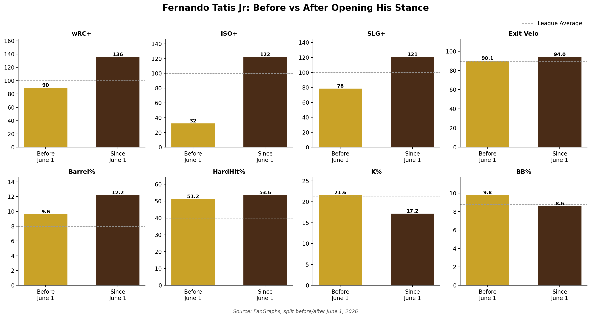

# Fernando Tatis Jr.: Opening His Stance

**Date:** August 9, 2026

Opened up his stance and has returned to elite play since June.

## Method

**Data sources**
- FanGraphs before/after splits (typed in, stored in `tatis_fangraphs_splits_2026.csv`)
- Baseball Savant pitch-level Statcast data, pulled with `pybaseball` (plate discipline and spray direction checks in the notebook)

**Date ranges**
- Before: 3/1/26 to 5/31/26
- Since: 6/1/26 to 8/9/26

**How it was calculated**
- The chart compares FanGraphs split values before and since June 1. Dashed line = league average for each stat (100 for plus stats).
- wRC+, ISO+ and SLG+ are FanGraphs plus stats, where 100 = league average.
- Spray direction in the notebook uses Statcast hit coordinates: pull = spray angle under −15°, oppo = over +15°.

## Files

| File | Contents |
|---|---|
| `tatis_open_stance_2026.ipynb` | Statcast pulls, plate discipline and spray checks, earlier chart versions, featured chart saved to `../figures/` |
| `tatis_fangraphs_splits_2026.csv` | FanGraphs before/after values and league averages used in the chart |
| `tatis_statcast_before_june1_2026.csv` | Statcast pitch data, 3/1/26 to 5/31/26 (written by the notebook) |
| `tatis_statcast_since_june1_2026.csv` | Statcast pitch data, 6/1/26 to 8/9/26 (written by the notebook) |
