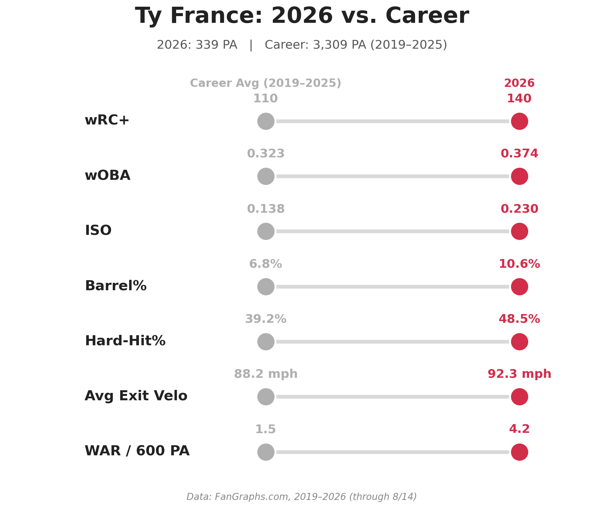
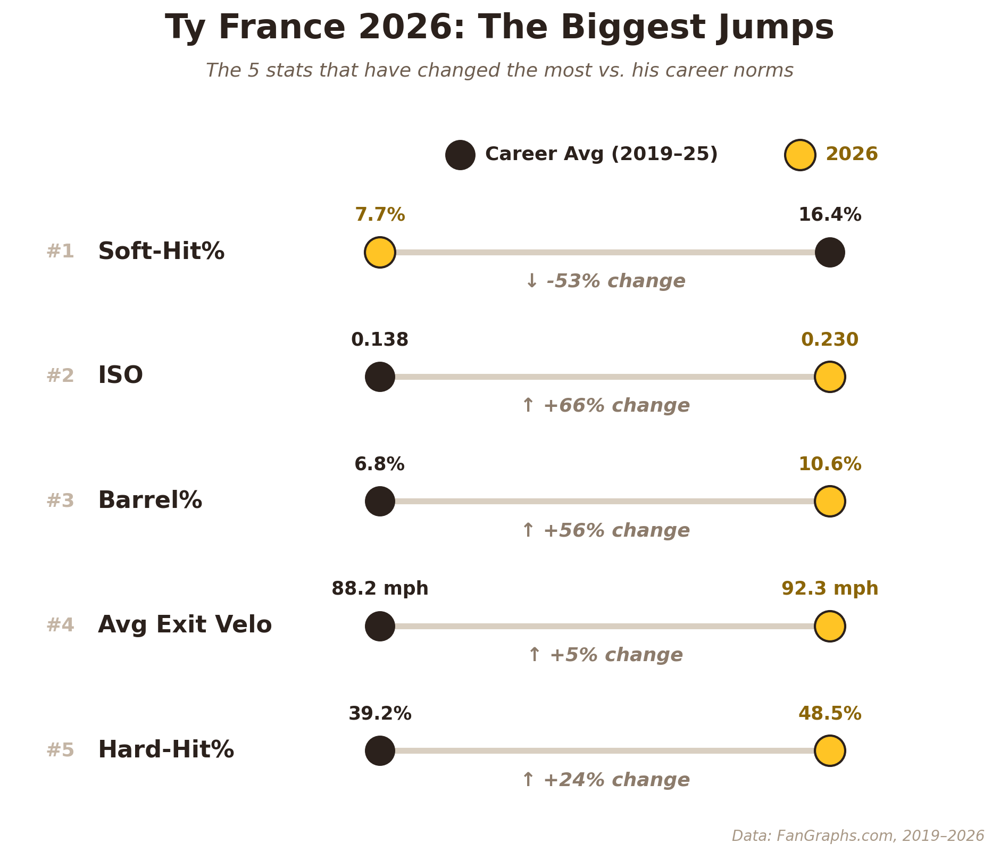
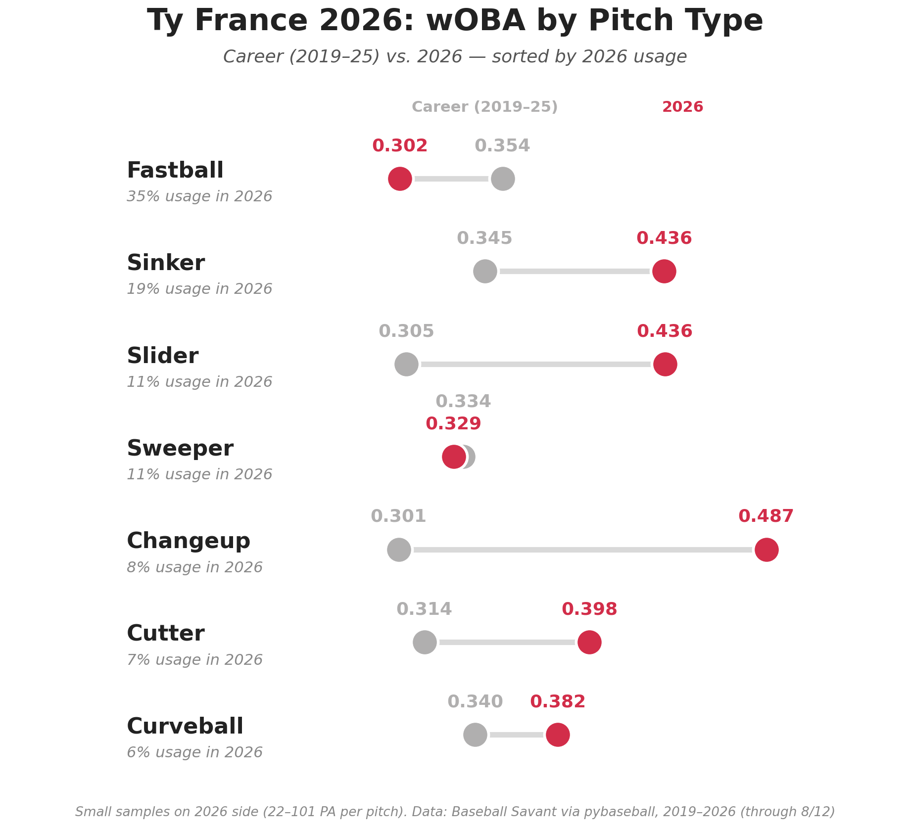

# Ty France 2026: Breakout vs Career

**Date:** August 14, 2026

Ty France is hitting like a different player. 140 wRC+ in 339 PA this year, after a 110 career mark from 2019 to 2025.

It's the contact.
- Soft hit%: 7.7%, down from 16.4%
- Hard hit%: 48.5%, up from 39.2%
- Barrel%: 10.6%, up from 6.8%
- Avg exit velo: 92.3 mph, up from 88.2
- ISO: .230, up from .138

He's doing damage on almost everything. Sinkers: .436 wOBA (career .345). Sliders: .436 (.305). Changeups: .487 (.301). Four seamers are the exception at .302, down from .354.

Small samples by pitch, 22 to 101 PA each.

## Method

**Data sources**
- FanGraphs season-by-season export (manual CSV download)
- Baseball Savant pitch-level Statcast data, pulled with `pybaseball`

**Date ranges**
- FanGraphs: 2019–2026, 2026 through 8/14
- Statcast: 2019–2026, 2026 through 8/12, regular season only

**How it was calculated**
- Career average = PA-weighted mean of his 2019–2025 seasons.
- Biggest jumps: each stat's 2026 change vs his career average, divided by his season-to-season standard deviation (2019–2025). Top 5 by size shown. Candidates: wRC+, wOBA, ISO, Barrel%, Hard-Hit%, Avg Exit Velo, Soft-Hit%, WAR/600 PA. The % change label is (2026 − career) / career.
- wOBA by pitch type = wOBA value / wOBA denominator on plate appearances ending with that pitch. Fastball includes FF and FA. Curveball includes CU and KC. Usage = share of all pitches seen in 2026.

## Files

| File | Contents |
|---|---|
| `ty_france_2026.ipynb` | Loads the FanGraphs export, pulls Statcast, calculates everything, saves all three charts to `../figures/` |
| `ty_france_career_stats_2026.csv` | FanGraphs season-by-season stats, 2019–2026 (2026 through 8/14) |
| `ty_france_statcast_2019_2026.csv` | Statcast pitch data faced, 2019 to 8/12/26 (written by the notebook) |
