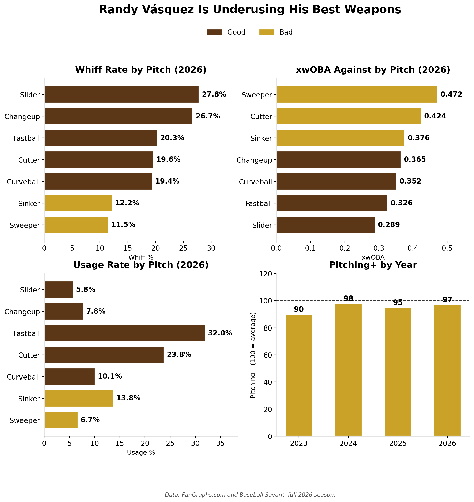

# Randy Vásquez: Underusing His Best Weapons

**Date:** August 10, 2026

*Numbers as of August 2026.*

Vásquez's two best whiff pitches barely get thrown.
- Slider: 27.8% whiff, .289 xwOBA, 5.8% usage
- Changeup: 26.7% whiff, 7.8% usage

The fastball (32.0%) and cutter (23.8%) carry the load, and the cutter gives up a .424 xwOBA. The sweeper is his worst pitch: 11.5% whiff, .472 xwOBA.

Pitching+ has sat under 100 every year since 2023.

The fix is simple. More sliders and changeups, fewer cutters and sweepers.

## Method

**Data sources**
- FanGraphs (Pitching+ by season as of August 2026, pitch-level whiff% and usage)
- Baseball Savant (xwOBA against by pitch)
- All values typed in by hand, stored in `vasquez_hand_entered_values_2026.csv`

**Date ranges**
- 2026 season as of August 2026
- Pitching+: 2023–2026

**How it was calculated**
- Bar color: brown = good, gold = bad. Whiff% cutoff is 19.1%. xwOBA cutoff is .370. Usage bars take the pitch's whiff% color. Pitching+ cutoff is 100 (league average).

## Files

| File | Contents |
|---|---|
| `vasquez_pitch_mix_2026.ipynb` | Loads the values, builds the four-panel chart, saves it to `../figures/` |
| `vasquez_hand_entered_values_2026.csv` | All plotted values and color cutoffs, with source notes |
